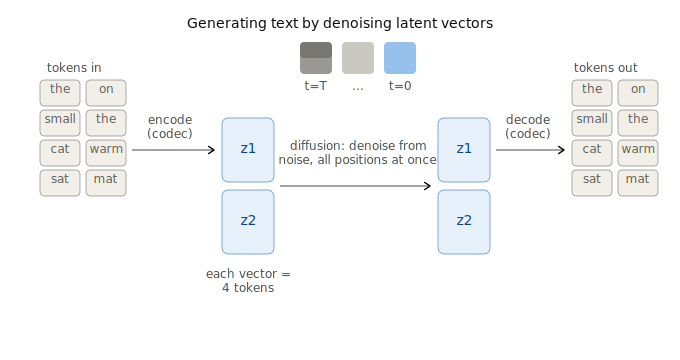
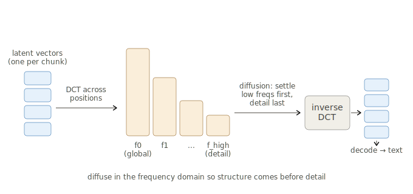

# Findings and roadmap

A proof of concept for a continuous-latent diffusion language model with a frequency-domain variant. Written in JAX, trained on a TPU (Colab v5e), at TinyStories scale.

## The idea

Most language models predict one discrete token at a time. This follows the CALM line of work, which predicts continuous vectors instead of tokens, and takes it toward diffusion.

There are three pieces. A codec compresses 4 tokens into one vector and reconstructs them. A diffusion model generates a sequence of those vectors in parallel, denoising from noise over several passes instead of going left to right. A spectral variant runs the same diffusion in the frequency domain, applying a DCT across positions so that coarse structure is set first and detail last.

Continuous vectors suit Gaussian diffusion better than discrete tokens do, and packing 4 tokens into each vector means the diffuser handles a quarter as many positions. Generating in parallel also makes infilling and self-correction possible, neither of which a left-to-right model can do.

## What I built

Three stages, each a module and a notebook:

- `codec.py` — the VAE codec, 4 tokens to a 64-d vector (Stage 1).
- `diffusion.py` — the denoiser plus generate, infill, and self-correct (Stage 2).
- `spectral.py` — the DCT variant and the comparison (Stage 3).

Everything runs in JAX/Flax on a single TPU core, with checkpoint and resume through Drive.

## Results

### Codec

Four tokens to a 64-d vector, a VAE with a KL term and noise injection during training. After 20k steps it reconstructs about 99.96% of tokens. The KL term fell from roughly 16 to 2.6 over training, so the latent space got smoother as accuracy climbed, which helps the diffusion stage. Round-tripping held-out text is near perfect.

### Diffusion and spectral

The denoiser is a bidirectional transformer, width 512 and depth 8, over 16 positions (64 tokens of context), self-conditioned and trained for 80k steps. Training is stable. The loss settles around 0.42 and stays noisy, which is expected for a loss averaged over noise levels.

Generation produces real TinyStories words and believable short fragments, but nothing coherent at the level of a sentence or story. The spectral variant looks about the same, with no clear gain. That fits the expectation that a frequency basis reorganises the problem without adding capacity.

The parallel decode does work: 50 denoising passes produce a 64-token sequence, against 64 sequential steps for an autoregressive model. The throughput figure I currently have comes from an unoptimised sampler and understates the real speed.

## Where it stands

The codec and the generate-by-denoising mechanism both work. What doesn't yet is generation quality at 4 tokens per vector.

Text decoding is sharp: a small error in a 64-d vector decodes to the wrong token, unlike an image, where a slightly-off latent is just a slightly blurry pixel. A small denoiser on a small budget can't land on the latent manifold precisely enough, and moving to a frequency basis doesn't change that. Coherent text needs scale.

## Roadmap

### Scale the denoiser

A bigger model, more steps, longer context, and few-step distillation. This is the direct fix and the main thing more compute buys.

### Structure-aware chunking for code

Don't spend vectors on syntax a parser already knows. Print the fixed skeleton by rule and only encode the parts that vary.

A function such as `fn <name>() -> <ret> { <body> }` becomes a few content vectors instead of the 15 to 20 tokens it usually costs. Because the keywords, brackets, and arrows are printed by rule, the output is always syntactically valid, and that share of the tokens is reconstructed exactly. The parser is only used when preparing data, never at generation time.

### Variable-size chunking

Allocate vectors by how much information a span carries, not by token count.

A predictable phrase like "once upon a time" collapses into one vector, while a rare name or number gets its own short chunk. Each vector then carries about the same amount of information, which removes the worst case where a dense four-token span overflows a single vector. This goes straight at the quality problem above.

### Decoder-aware training and self-correction

Train the denoiser with a term that rewards latents which decode correctly, not only ones that are close in MSE, and use the codec's own reconstruction signal to find and redo bad chunks.

## Why this needs TPUs

Each of those needs compute: a larger denoiser, retraining the codec around new chunkers, and longer runs. The PoC shows the pipeline works on a single TPU core and pins down the bottleneck. Closing it is what the TPU request is for.

## Reproducing

`notebooks/01_codec.ipynb`, `02_diffusion.ipynb`, and `03_spectral.ipynb`. Each clones the repo and runs in-kernel on a Colab TPU runtime.
